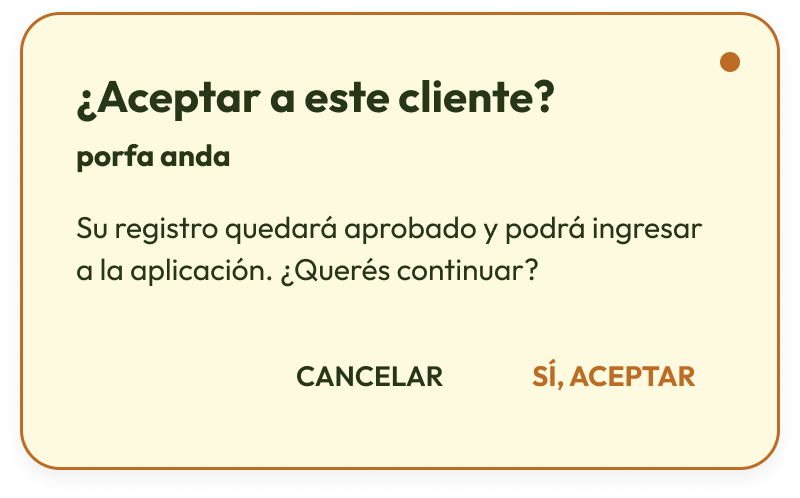
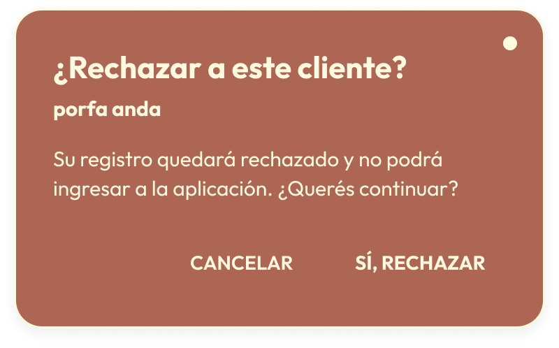
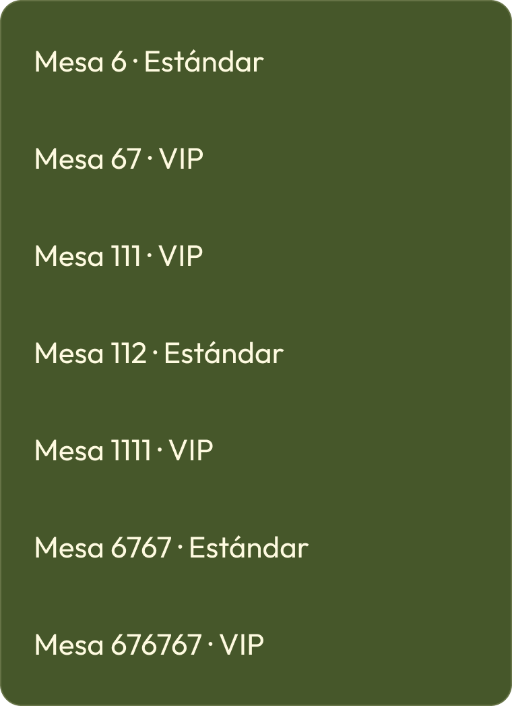

# Big-N-2026

## Índice

- [Integrantes y responsabilidades](#integrantes-y-responsabilidades)
- [Módulos asignados](#módulos-asignados)
- [Cambios y reasignaciones](#cambios-y-reasignaciones)
- [Códigos QR](#códigos-qr)
- [Pantallas](#pantallas)
- [Logo](#logo)

## Integrantes y responsabilidades

Las responsabilidades se organizan según los módulos (objetivos) funcionales asignados a cada integrante.

| Integrante | Módulos (objetivos) |
|---|---|
| **Soria Matias (Líder)** | 01, 08, 18, 19, 22 |
| **Cespedes Andrés** | 02, 03, 06, 11, 15, 20 |
| **Terenghi Goy Estéfano** | 04, 09, 10, 13, 16 |
| **Romero Facundo** | 05, 07, 12, 14, 17, 21 |

## Módulos asignados

| Nº | Módulo (objetivo)                                 | Responsable  | Inicio | Finalización | Branch | Estado |
| -: | ------------------------------------------------- | ------------ | --------------- | --------------------- | --------- | --------- |
| 01 | Agregar un empleado                               | Soria        | 28/08 | 02/09 | - | Finalizado |
| 02 | Agregar un nuevo plato                            | Cespedes     | 26/08 | 28/08 | feat(hu02): implementar interfaz de alta de plato + demo-alta-movil | Finalizado |
| 03 | Agregar una nueva bebida                          | Cespedes     | 28/08 | 28/08 |feat(hu03): implementar interfaz de alta de bebida + demo-alta-movil|  Finalizado |
| 04 | Agregar una nueva mesa                            | Terenghi Goy | 25/08 | 26/08 | feature/04-alta-mesa | Finalizado |
| 05 | Crear un cliente registrado                       | Romero | 03/9 | 03/9 | feature/hu05-crear-cliente-registrado | Finalizado |
| 06 | Verificar ingreso del cliente registrado          | Cespedes     | 03/09 | 03/09 | feature/hu06-acceso-listado-clientes | Finalizado |
| 07 | Rechazar a un cliente registrado                  | Romero       | 01/09 | 02/09 | - | Finalizado |
| 08 | Aceptar a un cliente registrado                   | Soria        | 03/09 | 03/09 | - | Finalizado |
| 09 | Ingresar al local como cliente anónimo            | Terenghi Goy | 01/09 | 02/09 | feature/09-10 | Finalizado |
| 10 | Asignar una mesa a un cliente registrado          | Terenghi Goy | 01/09 | 03/09 | feature/09-10 | Finalizado |
| 11 | Visualizar productos y realizar consultas al mozo | Cespedes     | 04/09 | 06/09 | feature/hu11-carta-consulta-mozo-chat | Finalizado |
| 12 | Realizar un pedido                                | Romero       | 09/09 | 09/09 | feature/hu12-realizar-pedido | Finalizada |
| 13 | Rechazar y modificar un pedido                    | Terenghi Goy | - | - | - | Pendiente |
| 14 | Confirmar y derivar un pedido                     | Romero       | - | - | - | Pendiente |
| 15 | Acceder a juegos y obtener descuentos             | Cespedes     | - | - | - | Pendiente |
| 16 | Recepción de productos en cocina                  | Terenghi Goy | - | - | - | Pendiente |
| 17 | Recepción de productos en bar                     | Romero       | - | - | - | Pendiente |
| 18 | Finalizar la preparación del pedido               | Soria        | - | - | - | Pendiente |
| 19 | Entregar y recibir el pedido                      | Soria        | - | - | - | Pendiente |
| 20 | Realizar encuesta y visualizar resultados         | Cespedes     | - | - | - | Pendiente |
| 21 | Solicitar y generar la cuenta                     | Romero       | - | - | - | Pendiente |
| 22 | Confirmar el pago y liberar la mesa               | Soria        | - | - | - | Pendiente |

## Cambios y reasignaciones

| Fecha | Módulo | Cambio | Responsable anterior | Nuevo responsable | Nueva finalización |
|---|---:|---|---|---|---|
| — | — | — | — | — | — |

## Códigos QR

- **QR de ingreso al local**
- **QR de mesa**
- **QR de propina — Excelente — 20 %**
- **QR de propina — Muy Bueno — 15 %**
- **QR de propina — Bueno — 10 %**
- **QR de propina — Regular — 5 %**
- **QR de propina — Malo — 0 %**

## Pantallas

| Nombre de pantalla | Imágen de pantalla | Misceláneos |
| :---: | :---: | :---: |
| Lista de empleados |  | <!-- agregar imagen --> |
| Agregar un empleado |  |  |
| Lista de productos (platos) |  | <!-- agregar imagen --> |
| Lista de productos (bebidas) |  | <!-- agregar imagen --> |
| Lista de clientes (todos) |  | <!-- agregar imagen --> |
| Lista de clientes (pendientes) |  |   |
| Lista de mesas |  | <!-- agregar imagen --> |
| Agregar una mesa |  |  |
| Lista de espera |  |  |

## Logo

